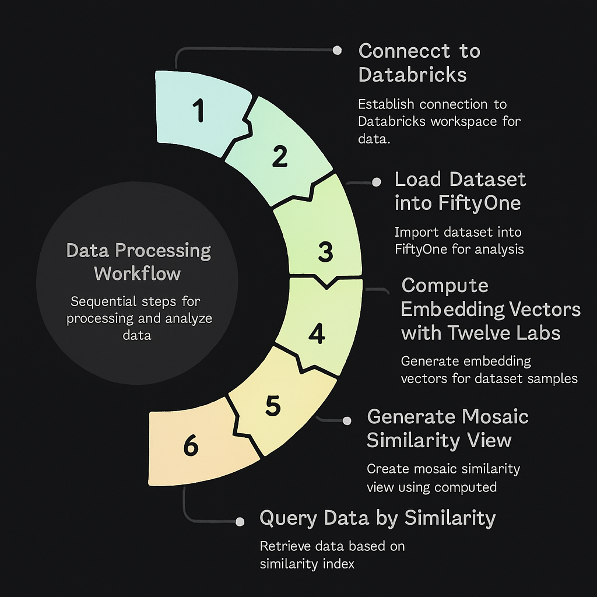

# 🔍 Visual Search with FiftyOne + Twelve Labs + Mosaic AI on Databricks
  

This project demonstrates how to build a scalable visual search workflow using:

- FiftyOne for dataset visualization and management
- Twelve Labs for multimodal video embeddings
- Mosaic AI Vector Search on Databricks for hyperscale retrieval

🔧 Search your video datasets by image, text, or clip similarity—all in one cloud-native pipeline.



##  🚀 What You’ll Learn 
- Set up your Databricks Catalog and Vector Search endpoint
- Load and index video clip embeddings using the Twelve Labs FiftyOne plugin
- Perform multimodal queries (image + text)
- Visualize results in the FiftyOne App

## 🛠️ Setup
## 1. Clone and Install
```
git clone https://github.com/danielgural/fiftyone_twelvelabs_databricks_demo.git
cd fiftyone_twelvelabs_databricks_demo
pip install -r requirements.txt
```
Or manually install:

```
pip install fiftyone databricks-vectorsearch python-dotenv umap-learn twelvelabs
fiftyone plugins download https://github.com/danielgural/semantic_video_search
```

## 2. Configure Environment
You’ll need a .env file with the following:

```
DATABRICKS_HOST=...
DATABRICKS_TOKEN=...
CATALOG_NAME=...
SCHEMA_NAME=...
VECTOR_SEARCH_ENDPOINT=...
```

To get these:
1. Go to Databricks Catalog → create new catalog/schema
2. Enable Vector Search via Compute
3. Create and paste your Personal Access Token

## ▶️ Run the Demo
Open the notebook:

```
jupyter notebook demo.ipynb
```

The notebook walks through:
- Loading your dataset
- Extracting clip-level embeddings using Twelve Labs
- Indexing to Databricks Vector Search
- Querying by image or text
- Visualizing results using the FiftyOne App

## 📊 Example Use Cases
- Semantic video search across security footage or training datasets
- Multimodal retrieval by text caption, voiceover, or visual similarity
- Active learning: find hard examples or edge cases fast

## 📚 More Resources
📘 [FiftyOne + Mosaic AI docs](https://docs.voxel51.com/integrations/mosaic.html)

🧩 [Twelve Labs Plugin](https://github.com/danielgural/semantic_video_search)

🔍 [FiftyOne Documentation](https://docs.voxel51.com)

🪪 License
MIT
